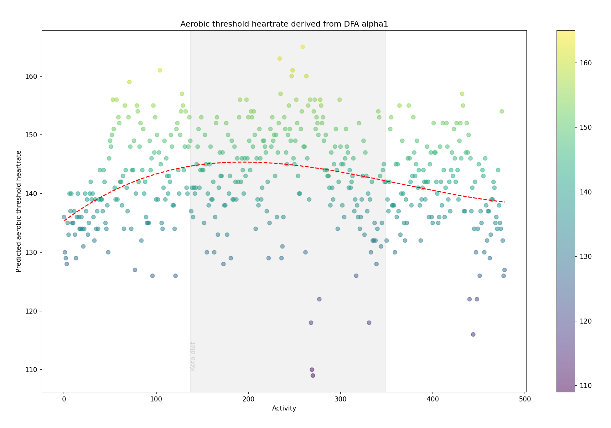
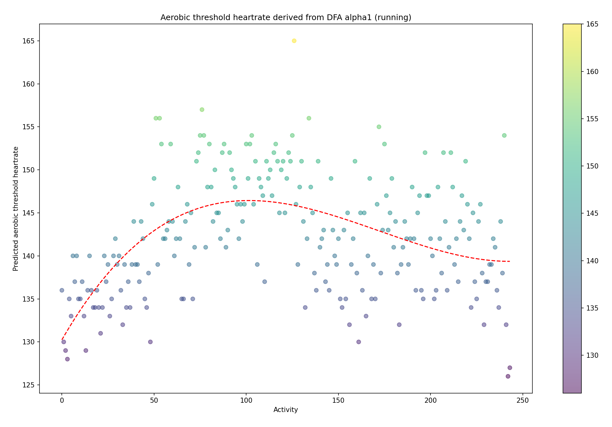
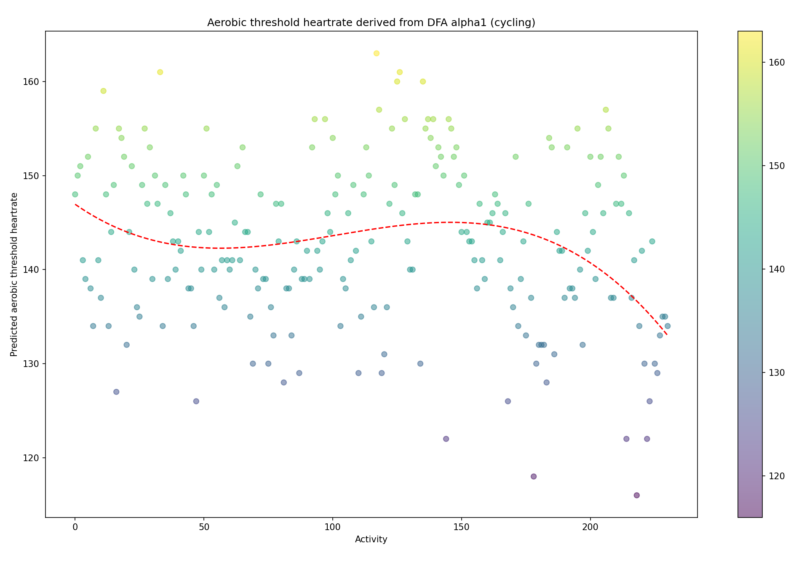

# Aerobic_Threshold_Estimation_from_DFA_Alpha1

This has been inspired by Marco Altini's work: https://colab.research.google.com/drive/1GUZVjZGhc2_JqV-J5m1mgbvbiTBV9WzZ?usp=sharing#scrollTo=dPto519o_Cq1.
The script uses HRV data from ~500 activities and computes alpha 1 from detrended fluctuation analysis (DFA) for each. The datases is from a single athlete, colected over peried of 2 years.

It contains two functions: DFA and computeFeatures. The DFA function is used to perform detrended fluctuation analysis on a given time series. The computeFeatures function computes various features such as heart rate, RMSSD, SDNN, and alpha1 from a given input dataset.

The code imports necessary libraries such as pandas, numpy, and matplotlib. The LinearRegression function is imported from sklearn.linear_model. The DFA function takes three arguments as input, namely pp_values, lower_scale_limit, and upper_scale_limit. The pp_values are the values of a given time series, while lower_scale_limit and upper_scale_limit are the limits of the scales at which the analysis is performed. The function uses detrended fluctuation analysis to compute the alpha value for each scale in the given range of scales. The alpha value is returned as the output of the function.

The computeFeatures function takes a pandas dataframe as input and computes various features from the given dataset. The function first divides the dataset into segments of 120 seconds and computes features such as heart rate, RMSSD, SDNN, and alpha1 for each segment. The output of the function is a pandas dataframe containing the computed features.

The main part of the code reads a CSV file containing heart rate variability data and performs data cleaning by removing values greater than one standard deviation from the mean and beat to beat differnces greater than 5%. The code then iterates over the dataset and performs the computeFeatures function on each segment of the data. The output of the function is stored in a list, which is then used to create a pandas dataframe.

Finaly it derives aerobic threshold heart rate using a simple linear model to estimate heart rate given alpha 1, The results are then ploted using matplotlib library.

*Scatter Plot Predicted Aerobic Threshold HR (All):*

*Scatter Plot Predicted Aerobic Threshold HR (Run,Cycle):*
 

*Notes:*

* The estimated aerobic threshold value for the current time period is within 1 bpm of the LT1 value that was confirmed through a lab test.

* The dataset .csv file can be downloaded from here: https://www.dropbox.com/s/1m22w99znl2rlb3/ACR_HRV_Data_3.csv?dl=0

Resources:
* https://colab.research.google.com/drive/1GUZVjZGhc2_JqV-J5m1mgbvbiTBV9WzZ?usp=sharing#scrollTo=dPto519o_Cq1
